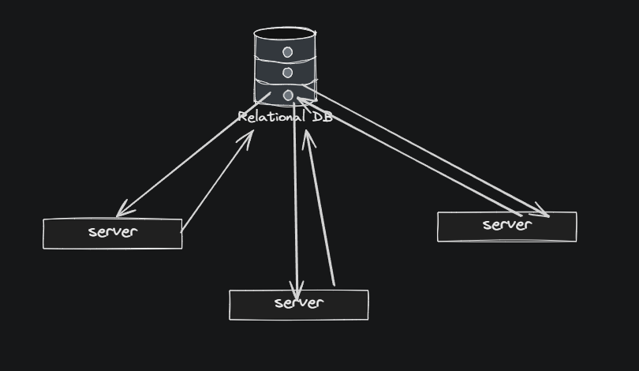
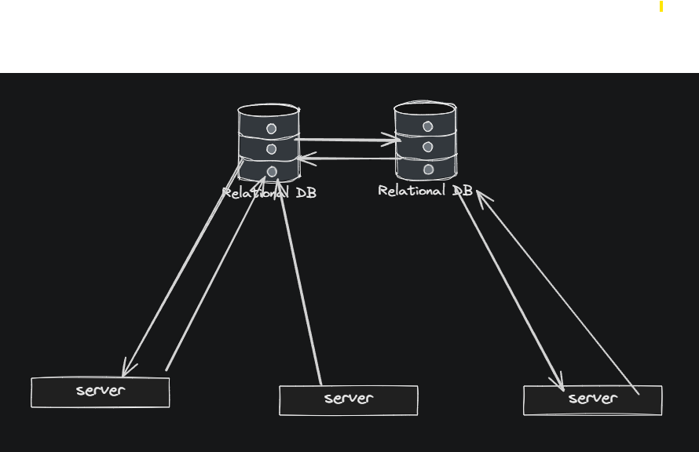

# Consistency Patterns

A simulation of two distributed-systems consistency patterns - **strong**
and **eventual** - built on a shared `Node`/`Network` foundation, so both
can be compared fairly on the exact same example.

This project is a companion to an earlier CAP theorem project, but it
answers a different question. CAP theorem is about the tradeoff a system is
forced into *during a network partition* (give up consistency, or give up
availability). This project is about something more specific: once you've
decided your system will have multiple copies of the same data spread
across different machines, **how and when do those copies actually agree
with each other?** That's what a consistency pattern describes.

No external dependencies - Python standard library only (`time`, `random`,
`threading`).

## The example

Both patterns are demonstrated against the same scenario: a small book
store with an inventory (`book_store.py`). Two operations matter:

- **Searching for a book** (a *read*)
- **Buying a book** (a *write* - specifically, a "decrement stock, but only
  if stock > 0" conditional write)

Running the same operations through both patterns is what makes the
comparison meaningful - the pattern is the only thing that changes.

## Files

| File | Purpose |
|---|---|
| `Node.py` | A single node - holds its own local copy of the data, simulates network latency. |
| `Network.py` | Base class managing a collection of nodes. Does **not** implement `write()`/`read()` - each pattern subclasses this and defines its own behavior. |
| `book_store.py` | Shared `Book` data model, catalog seeding, and snapshot printing - used by both patterns. |
| `strong.py` | `StrongConsistencyNetwork` |
| `eventual.py` | `EventualConsistencyNetwork` |
| `main.py` | Banner-style demo comparing strong vs. eventual - timing, the oversell race, convergence. |

## The two patterns

### Strong consistency (`strong.py`)



There's a single source-of-truth node (the primary). Every write is
synchronously pushed to every other node before it returns - nothing is
"done" until everyone agrees. Reads are always confirmed against the
primary.

- ✅ Never returns wrong data. A `write_with_check()` guarded by a
  `threading.Lock()` means two concurrent buyers can never both purchase the
  same last copy of a book.
- ❌ Slowest of the two. Both writes *and* reads pay coordination cost, and
  that cost grows with the number of nodes (write time roughly scales with
  cluster size).

### Eventual consistency (`eventual.py`)



A write touches only the origin node and returns immediately - no lock, no
waiting. Propagation to every other node is **guaranteed** to happen; it
just runs on a background thread instead of blocking the write.
`convergence()` proves this: once every pending thread finishes,
all nodes are guaranteed to agree.

- ✅ Fast writes - one hop, no coordination - with a real guarantee: stop
  writing, wait long enough, and every node will agree.
- ❌ Has the *same* oversell race as an uncoordinated write would - "eventually
  consistent" does not mean "eventually correct." It only guarantees nodes
  converge on *some* final value, not that the value is right. It's also
  honest to note the current implementation resolves conflicting concurrent
  writes with **last-write-wins-by-accident** (whichever background thread
  happens to finish last overwrites the rest) - real systems use timestamps,
  version vectors, or CRDTs to make that outcome deterministic instead of
  arbitrary.

## Running it

```
python3 main.py       # strong vs. eventual: speed + correctness comparison
```

Each pattern file can also be run standalone (`python3 strong.py`,
`python3 eventual.py`) for a smaller, focused demo of just that pattern.

## Why no weak consistency?
 
Weak consistency isn't covered here as its own pattern because structurally, weak is *eventual with
one guarantee removed*: the write path is identical (touch the origin node,
return immediately, no lock) - the only difference is that a propagation
attempt to another node can be silently dropped and never retried, instead
of being guaranteed to eventually run on a background thread. In other
words, eventual consistency is a strictly stronger, better-specified version
of the same idea - which is also exactly how the original project notes
described it ("eventual consistency is a type of weak consistency").
 
**Weak's strengths:**
- The absolute floor on cost - no lock, no retry logic, no background
  thread bookkeeping to maintain at all.
- A genuinely good fit for data where being wrong is free - a metrics
  counter, a "likes" count, anything nobody will ever audit.

**Weak's weaknesses:**
- No correctness guarantee (same oversell risk as eventual).
- No convergence guarantee either - unlike eventual, waiting longer doesn't
  help, because a dropped update was never attempted in the first place,
  so there's nothing pending to catch up on. Nodes can disagree forever
  even after writes stop.
- Failures are silent by design, which makes it the hardest of the three to
  reason about or debug - there's no signal anywhere that a node fell
  behind.
Given that eventual consistency already demonstrates the fast/no-lock write
path, and strong vs. eventual already covers the main educational contrast
this project is built around (guaranteed-correct-but-slow vs.
fast-but-only-eventually-agreeing), adding weak as a third pattern would
have mostly repeated eventual's code path while subtracting its one
distinguishing feature - the guarantee. 

## Known limitations / honest caveats

This is a single-process simulation - both "networks" are really just
Python objects in one process, which makes a few things easier here than
they'd be in real life:

- **No real network calls.** `latency_range()`/`time.sleep()` stand in for
  actual network round-trips. Real systems also have to handle a node
  crashing mid-update, a message getting lost in transit, or a machine
  rebooting - failure modes this simulation doesn't attempt to model.
- **`convergence()` isn't a real operation.** No real client can
  ask "has the whole cluster settled yet" - it exists purely so `main.py`
  can *prove* convergence happened, not because any participant in a real
  system could ask that question. Real systems either tolerate staleness
  outright, offer narrower guarantees like read-your-own-writes, or expose
  replication lag as an ops metric - not a blocking call.
- **Propagation is push-based via threads**, not the gossip protocols,
  hinted handoff, or read-repair mechanisms real eventually-consistent
  systems use to actually guarantee delivery across independent,
  unreliable machines.
- **Conflict resolution is last-write-wins by accident**, not by design (see
  above) - a real limitation worth improving if this project continues.